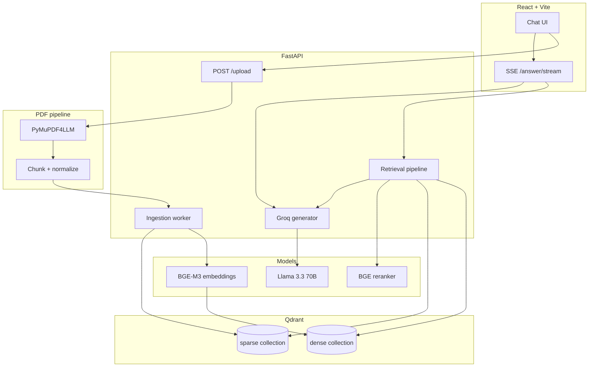

# Paper Assistant

**A production-style RAG workspace for research PDFs** — upload papers, index them in a hybrid vector store, and ask grounded questions with streamed answers, LaTeX-ready markdown, and collapsible source citations.

Built as a full-stack system (FastAPI + React) with a retrieval pipeline designed around real paper workflows: multi-document libraries, per-document scoping, background ingestion, and citation-backed generation.

---

## Why this project exists

Reading a 20-page ML paper and hunting for “what loss they used” or “how attention is defined” is slow. Paper Assistant treats each PDF as a **searchable knowledge base**: chunks are parsed, embedded, and retrieved on demand; answers are synthesized by an LLM **only from retrieved passages**, with explicit source attribution.

The focus is not a chat wrapper — it is an **end-to-end ingestion → retrieval → generation** pipeline with observable status, durable metadata, and a UI tuned for technical content (equations, tables, structured answers).

---

## Highlights (what reviewers often look for)

| Area | What you get |
|------|----------------|
| **Retrieval** | Dense (BGE-M3) + sparse (hashed BoW) hybrid search with **RRF fusion**, optional **cross-encoder reranking** (BGE reranker v2-m3) |
| **Storage** | **Qdrant Cloud** (or self-hosted) with separate dense/sparse collections and `doc_id` payload filtering |
| **Parsing** | **PyMuPDF + pymupdf4llm** — page-aware markdown, recursive chunking, content-addressed cache (`data/extracted/`) |
| **Generation** | **Groq** (Llama 3.3 70B) with prompts tuned for structured markdown, LaTeX, and inline citations |
| **UX** | SSE streaming, KaTeX math, GFM tables, collapsible sources, slide-out library, document scoping |
| **Ops** | Health checks, background ingest, persisted ingestion status, embedding disk cache, pytest suite |

---

## Architecture



### Request flow (question → answer)

1. **Upload** — PDF bytes are hashed, parsed to page-level markdown, chunked (~1.1k chars, overlap), and queued for background ingest.
2. **Index** — Batches are embedded (HF Inference API), sparse vectors built, and upserted to Qdrant; progress is written to `data/ingestion_status.json` and the document registry.
3. **Query** — User question is embedded; **hybrid search** pulls top-*k* chunks (optional **doc_id** filter when a paper is scoped).
4. **Rerank** — Cross-encoder rescores candidates (with graceful fallback if the API fails).
5. **Generate** — Top passages are sent to Groq; tokens stream to the client over **Server-Sent Events**; sources are attached as structured metadata for the UI.

---

## Tech stack

| Layer | Technologies |
|-------|----------------|
| **API** | Python 3.11+, FastAPI, Uvicorn, Pydantic v2 |
| **Retrieval** | `qdrant-client`, Hugging Face Inference (`BAAI/bge-m3`, `BAAI/bge-reranker-v2-m3`) |
| **LLM** | Groq API (`llama-3.3-70b-versatile`) |
| **PDF** | PyMuPDF, pymupdf4llm |
| **Frontend** | React 19, TypeScript, Vite 7 |
| **UI** | react-markdown, remark-gfm, remark-math, rehype-katex, Lucide |
| **Tests** | pytest |

---

## Repository layout

```
paperassistant/
├── backend/
│   ├── app/
│   │   ├── main.py              # HTTP API + SSE streaming
│   │   ├── dependencies.py      # Shared singleton clients
│   │   ├── models.py            # Pydantic request/response models
│   │   ├── core/config.py       # Data directories
│   │   └── services/
│   │       ├── pdf/parser.py    # Parse, chunk, cache by doc hash
│   │       ├── indexing/        # Ingest, status, registry, cleanup
│   │       ├── embeddings/      # HF embed + rerank + disk cache
│   │       ├── retrieval/       # RRF, sparse vectors, pipeline
│   │       ├── storage/         # Qdrant client + config
│   │       └── llm/             # Groq prompts + streaming
│   ├── config.yaml              # Models, collection names
│   ├── run.sh                   # Uvicorn from repo root (PYTHONPATH)
│   └── tests/
├── frontend/
│   ├── src/
│   │   ├── App.tsx
│   │   ├── components/          # Chat, citations, sources drawer, markdown
│   │   └── api.ts
│   └── run_frontend.sh
├── data/                        # Gitignored runtime data
│   ├── uploads/                 # Raw PDFs
│   ├── extracted/               # Parsed JSON per doc_id
│   ├── cache/                   # Embedding cache
│   ├── documents.json           # Document registry
│   └── ingestion_status.json
├── .env.example
└── requirements.txt
```

---

## Quick start

### Prerequisites

- **Python 3.11+**
- **Node.js 18+**
- **[Qdrant Cloud](https://cloud.qdrant.io/)** cluster (or local Qdrant)
- API keys:
  - [Hugging Face](https://huggingface.co/settings/tokens) → `HF_TOKEN` (embeddings + reranker)
  - [Groq](https://console.groq.com/) → `GROQ_API_KEY`
  - Qdrant → `QDRANT_URL`, `QDRANT_API_KEY`

### 1. Configure environment

```bash
cp .env.example .env
```

Edit `.env` (from Qdrant Cloud → **Connect**):

```env
QDRANT_URL=https://<cluster-id>.<region>.cloud.qdrant.io:6333
QDRANT_API_KEY=<your-key>
HF_TOKEN=<your-hf-token>
GROQ_API_KEY=<your-groq-key>
```

Optional: override models in `backend/config.yaml` (defaults: BGE-M3, BGE reranker v2-m3).

### 2. Install dependencies

```bash
# Backend (from repo root)
pip install -r requirements.txt
# or: pip install -e backend

# Frontend
cd frontend && npm install && cd ..
```

### 3. Run

**Terminal A — API** (must run from repository root):

```bash
./backend/run.sh
# → http://127.0.0.1:8000
# → http://127.0.0.1:8000/health
```

**Terminal B — UI**:

```bash
./frontend/run_frontend.sh
# → http://127.0.0.1:5173
```

Optional frontend override: `frontend/.env` with `VITE_BACKEND_URL=http://127.0.0.1:8000`.

### 4. Use the app

1. Open the UI → **Sources** → **Upload PDF**.
2. Wait for ingestion (status shown per document).
3. Click a paper to **scope** chat, or ask across the full library.
4. Open **search settings** (composer) to tune hybrid / dense-only, Top-K, reranker.

---

## API overview

| Method | Path | Description |
|--------|------|-------------|
| `GET` | `/health` | Qdrant, embedding model, Groq connectivity |
| `POST` | `/upload` | Upload PDF(s); background ingest |
| `GET` | `/ingestion`, `/ingestion/{doc_id}` | Ingestion timeline / status |
| `GET` | `/documents` | Merged library (Qdrant + registry + status) |
| `DELETE` | `/documents/{doc_id}` | Delete one document (vectors + artifacts) |
| `DELETE` | `/documents?doc_ids=…` | Delete selected documents |
| `POST` | `/query` | Synchronous Q&A (rate-limited) |
| `GET` | `/answer/stream` | **SSE** streamed answer + source metadata |

Stream events: `meta` (retrieved chunks), `token` (text deltas), `[DONE]`.

---

## Configuration

| Source | Purpose |
|--------|---------|
| `.env` | Secrets and **overrides** for `QDRANT_URL`, `QDRANT_API_KEY`, `HF_TOKEN` (wins over empty YAML placeholders) |
| `backend/config.yaml` | Collection names, model IDs, timeouts |

Local artifacts (gitignored): `data/uploads/`, `data/extracted/`, `data/cache/`, `data/documents.json`, `data/ingestion_status.json`.

---

## Design decisions (talking points for interviews)

**Hybrid retrieval instead of dense-only**  
Academic PDFs contain rare terms (architecture names, theorem labels). Combining dense semantic search with a sparse lexical leg and **Reciprocal Rank Fusion** improves recall when either signal alone misses a passage.

**Separate dense/sparse Qdrant collections**  
Lets you tune sparse vector naming per deployment (e.g. legacy `bm25` vs `sparse` on cloud) and query each leg independently before fusion.

**Content-addressed `doc_id`**  
SHA-256 of file bytes → stable identity across re-uploads; parsed output cached under `data/extracted/{doc_id}.json`.

**Background ingestion**  
Upload returns immediately; embedding batches run in FastAPI `BackgroundTasks` with durable status for the UI poll loop.

**Citation-first prompting**  
The LLM is instructed to use markdown structure, LaTeX for math, and inline `[Source Title, Page N]` citations — aligned with how researchers expect to verify claims.

**Frontend as a research surface**  
Not a generic chat box: document scoping, ingestion progress, advanced retrieval controls, KaTeX + GFM rendering, and user-controlled source disclosure.

---

## Testing

```bash
PYTHONPATH=. pytest backend/tests -q
```

Covers API contracts, config/env merging, RRF fusion, sparse vectors, PDF chunking, document merge logic, ingestion status persistence, and delete semantics.

---

## Limitations & natural extensions

- Requires live **Qdrant**, **Hugging Face Inference**, and **Groq** (no offline mode).
- Sparse leg uses custom hashed term vectors, not full BM25 index semantics.
- Figures/tables in PDFs are text-oriented (no multimodal image embeddings yet).
- Single-user local deployment (no auth/multi-tenancy).

**Plausible next steps:** OAuth, async job queue (Redis/Celery), evaluation harness (nDCG / citation accuracy), multi-user namespaces in Qdrant, or vision chunks for figures.

---

## License

Add your license here (e.g. MIT) before public release.

---

## Author

**Your Name** — [GitHub](https://github.com/yourusername) · [LinkedIn](https://linkedin.com/in/yourprofile) · your.email@example.com

> Replace the author block with your details before sharing with recruiters.
